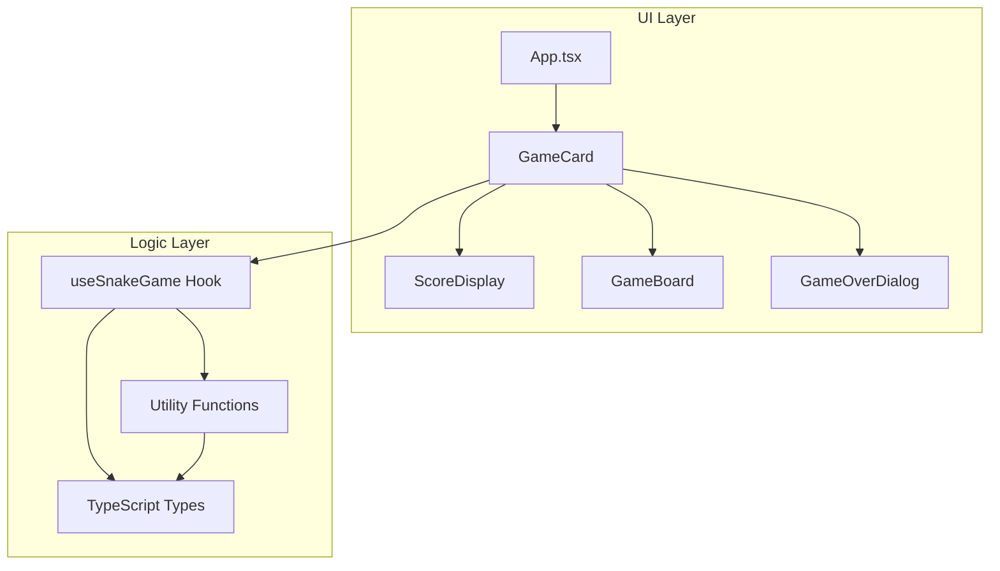
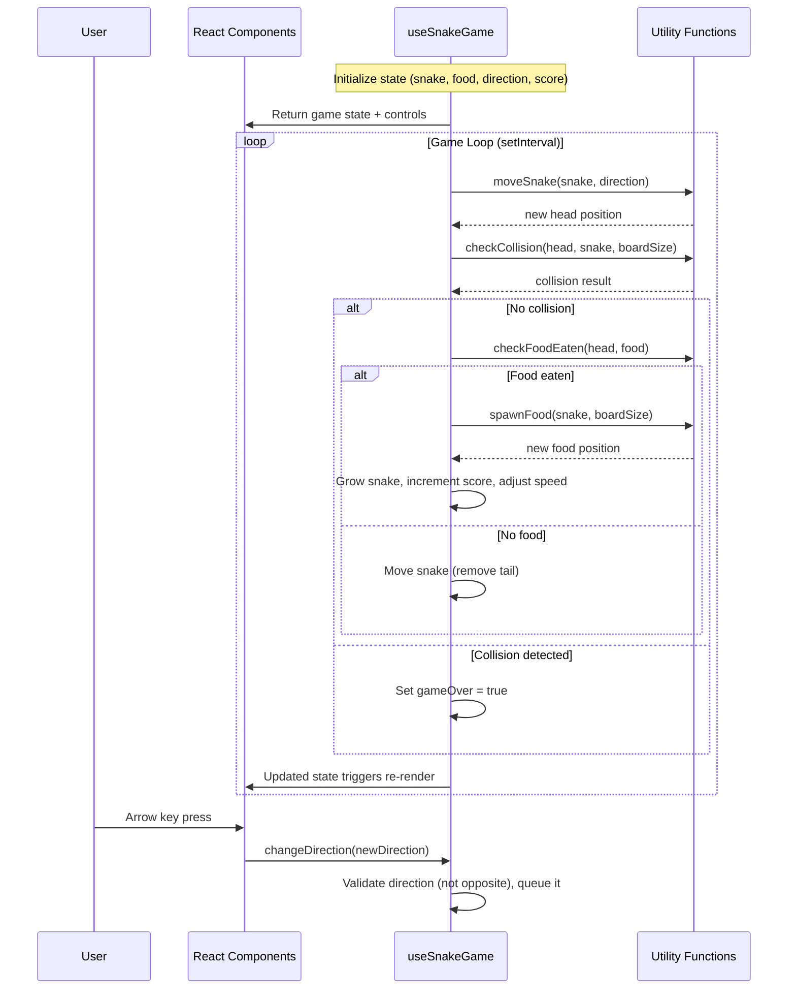

# Design Document

## Overview

This design describes a browser-based Snake Game built with Vite + React + TypeScript, managed by Yarn. The game renders a 20×20 grid where a snake moves automatically, consumes food to grow and score points, and ends when the snake collides with a wall or itself. The UI is built with [shadcn/ui](https://ui.shadcn.com/) components (Card, Dialog, Button) styled in a dark theme with Tailwind CSS. All game logic lives in a custom `useSnakeGame` hook, keeping the UI layer purely presentational.

The architecture follows a unidirectional data flow: the hook owns state and exposes it to React components, which render the board and handle user input via keyboard events. A `setInterval`-based game loop drives automatic movement, with the tick interval decreasing as the score rises (150ms → 120ms minimum).

## Architecture



### Data Flow



## Components and Interfaces

### React Components

#### `App` (src/App.tsx)
Root component. Renders the full-page centered layout with dark background.

#### `GameCard` (src/components/GameCard.tsx)
Wraps the entire game UI in a shadcn/ui `Card` component with dark styling, rounded corners, shadow, and padding. Contains `ScoreDisplay`, `GameBoard`, `RestartButton`, and `GameOverDialog`.

```typescript
interface GameCardProps {
  // No props — calls useSnakeGame internally
}
```

#### `ScoreDisplay` (src/components/ScoreDisplay.tsx)
Displays the current score above the game board.

```typescript
interface ScoreDisplayProps {
  score: number;
}
```

#### `GameBoard` (src/components/GameBoard.tsx)
Renders the 20×20 grid. Each cell is styled based on whether it contains the snake, food, or is empty. Uses CSS Grid layout. Memoized with `React.memo` to avoid unnecessary re-renders.

```typescript
interface GameBoardProps {
  snake: Position[];
  food: Position;
  boardSize: number;
}
```

#### `GameOverDialog` (src/components/GameOverDialog.tsx)
A shadcn/ui `Dialog` that appears when the game ends. Shows the final score and a restart button. Entrance animation via Tailwind CSS transitions.

```typescript
interface GameOverDialogProps {
  isOpen: boolean;
  score: number;
  onRestart: () => void;
}
```

### Custom Hook

#### `useSnakeGame` (src/hooks/useSnakeGame.ts)

Central game logic hook. Manages all state and exposes it to the UI.

```typescript
interface UseSnakeGameReturn {
  snake: Position[];
  food: Position;
  score: number;
  gameOver: boolean;
  direction: Direction;
  restart: () => void;
}

function useSnakeGame(boardSize?: number): UseSnakeGameReturn;
```

**Internal implementation details:**
- Uses `useRef` for the current direction to avoid stale closures in the interval callback
- Uses `useRef` for the interval ID to manage cleanup
- Uses `useState` for snake, food, score, and gameOver
- Uses `useEffect` to set up and tear down the game loop interval
- Uses `useEffect` to register/unregister keyboard event listeners
- Uses `useCallback` for the `restart` function and direction change handler
- Computes tick interval from score: `Math.max(120, 150 - Math.floor(score / 5) * 5)` (decreases by 5ms every 5 points, minimum 120ms)

### Utility Functions

#### `src/utils/gameUtils.ts`

```typescript
/** Calculate the next head position given current head and direction */
function getNextHead(head: Position, direction: Direction): Position;

/** Check if a position is outside the board boundaries */
function isOutOfBounds(position: Position, boardSize: number): boolean;

/** Check if a position collides with any segment in the snake body */
function isSelfCollision(head: Position, body: Position[]): boolean;

/** Check if two positions are equal */
function positionsEqual(a: Position, b: Position): boolean;

/** Spawn food at a random position not occupied by the snake */
function spawnFood(snake: Position[], boardSize: number): Position;

/** Check if a direction change is valid (not a 180° reversal) */
function isValidDirectionChange(current: Direction, next: Direction): boolean;

/** Calculate tick interval based on score */
function calculateTickInterval(score: number): number;
```

## Data Models

### Core Types (src/types/index.ts)

```typescript
/** A position on the game board (row, col) */
interface Position {
  row: number;
  col: number;
}

/** Cardinal movement directions */
enum Direction {
  UP = 'UP',
  DOWN = 'DOWN',
  LEFT = 'LEFT',
  RIGHT = 'RIGHT',
}

/** Complete game state (used internally by the hook) */
interface GameState {
  snake: Position[];
  food: Position;
  direction: Direction;
  score: number;
  gameOver: boolean;
}
```

### Direction Vectors

```typescript
const DIRECTION_VECTORS: Record<Direction, Position> = {
  [Direction.UP]:    { row: -1, col: 0 },
  [Direction.DOWN]:  { row: 1,  col: 0 },
  [Direction.LEFT]:  { row: 0,  col: -1 },
  [Direction.RIGHT]: { row: 0,  col: 1 },
};
```

### Opposite Direction Map

```typescript
const OPPOSITE_DIRECTIONS: Record<Direction, Direction> = {
  [Direction.UP]: Direction.DOWN,
  [Direction.DOWN]: Direction.UP,
  [Direction.LEFT]: Direction.RIGHT,
  [Direction.RIGHT]: Direction.LEFT,
};
```

### Constants

```typescript
const BOARD_SIZE = 20;
const INITIAL_SNAKE_LENGTH = 3;
const INITIAL_TICK_INTERVAL = 150; // ms
const MIN_TICK_INTERVAL = 120;     // ms
const INITIAL_DIRECTION = Direction.RIGHT;
```


## Correctness Properties

*A property is a characteristic or behavior that should hold true across all valid executions of a system — essentially, a formal statement about what the system should do. Properties serve as the bridge between human-readable specifications and machine-verifiable correctness guarantees.*

### Property 1: Movement produces correct offset

*For any* valid board position and *any* direction, `getNextHead(position, direction)` should return a position offset by exactly one step in the direction vector (e.g., UP decrements row by 1, RIGHT increments col by 1), with no other coordinates changed.

**Validates: Requirements 3.2**

### Property 2: Opposite direction is always rejected

*For any* current direction, `isValidDirectionChange(current, opposite(current))` should return `false`, and `isValidDirectionChange(current, nonOpposite)` should return `true` for all non-opposite directions.

**Validates: Requirements 3.4**

### Property 3: Food never spawns on the snake

*For any* snake configuration that does not fill the entire board, `spawnFood(snake, boardSize)` should return a position where `row` is in `[0, boardSize)` and `col` is in `[0, boardSize)`, and the returned position should not be equal to any position in the snake array.

**Validates: Requirements 4.2, 4.3, 4.4**

### Property 4: Food consumption grows snake and increments score

*For any* game state where the snake's next head position equals the food position, after processing the tick: the snake length should increase by exactly 1, and the score should increase by exactly 1.

**Validates: Requirements 5.1, 5.2**

### Property 5: Tick interval is monotonically non-increasing and bounded

*For any* two non-negative integer scores `a` and `b` where `a > b`, `calculateTickInterval(a) <= calculateTickInterval(b)`. Additionally, *for any* non-negative integer score, `calculateTickInterval(score) >= 120`.

**Validates: Requirements 6.2, 6.3**

### Property 6: Out-of-bounds detection is correct

*For any* position where `row < 0` or `row >= boardSize` or `col < 0` or `col >= boardSize`, `isOutOfBounds(position, boardSize)` should return `true`. *For any* position where `0 <= row < boardSize` and `0 <= col < boardSize`, it should return `false`.

**Validates: Requirements 7.1**

### Property 7: Self-collision detection is correct

*For any* snake body (array of positions) and *any* head position, `isSelfCollision(head, body)` should return `true` if and only if the head position equals at least one position in the body array.

**Validates: Requirements 7.2**

## Error Handling

### Audio Playback Failure
- The optional sound effect system wraps `Audio.play()` in a try-catch (or `.catch()` on the returned Promise)
- If playback fails (e.g., browser autoplay policy, missing file), the error is silently caught and the game continues without interruption
- No error UI is shown to the player for audio failures

### Food Spawning Edge Case
- If the snake fills the entire board (400 cells), `spawnFood` cannot find a valid position
- In practice this represents a "win" condition — the game should detect this and display a victory message or simply not spawn food
- The utility function should handle this gracefully (e.g., return `null` and the hook treats it as a win)

### Invalid Keyboard Input
- Non-arrow key presses are ignored by the keyboard event handler
- Opposite direction presses are silently rejected by `isValidDirectionChange`
- Key events during game-over state are ignored (listener is inactive)

### Interval Cleanup
- The `useEffect` cleanup function always clears the interval when the component unmounts or when `gameOver` becomes `true`
- This prevents memory leaks and ghost intervals

## Testing Strategy

### Property-Based Tests (using [fast-check](https://github.com/dubzzz/fast-check))

Each correctness property is implemented as a property-based test with a minimum of 100 iterations. The library `fast-check` is used for TypeScript/JavaScript property-based testing.

| Property | Test Target | Generator Strategy |
|----------|------------|-------------------|
| Property 1: Movement offset | `getNextHead` | Random `Position` (row/col in [-5, 25]) × random `Direction` |
| Property 2: Opposite rejection | `isValidDirectionChange` | All 4 directions as current × all 4 as next |
| Property 3: Food non-overlap | `spawnFood` | Random snake arrays (1–399 positions on 20×20 board) |
| Property 4: Food consumption | Game tick logic | Random valid game states where head lands on food |
| Property 5: Tick interval bounds | `calculateTickInterval` | Random non-negative integers for score |
| Property 6: Out-of-bounds | `isOutOfBounds` | Random positions (row/col in [-10, 30]) × board sizes |
| Property 7: Self-collision | `isSelfCollision` | Random snake bodies × random head positions (some overlapping, some not) |

Each test is tagged with: `Feature: snake-game, Property {N}: {description}`

### Unit Tests (using Vitest)

- **GameBoard rendering**: Verify 400 cells render for a 20×20 board
- **ScoreDisplay**: Verify score value is displayed
- **GameOverDialog**: Verify dialog shows final score and restart button
- **Initial state**: Verify snake length is 3, score is 0, tick interval is 150ms
- **Restart**: Verify all state resets to initial conditions
- **Keyboard handling**: Verify direction changes on arrow key press, ignored during game over
- **Audio**: Verify sound plays on food consumption, game continues on audio failure

### Integration Tests

- **Game loop**: Verify snake moves automatically each tick
- **Full game cycle**: Start → eat food → score increases → speed increases → hit wall → game over → restart
